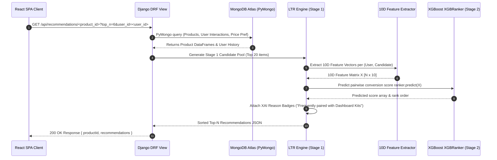

# 📡 NeuroUX API Endpoint Reference Specification

This document provides a comprehensive REST API specification for both the **Express Backend API** (Port 5000) and the **Django Machine Learning Recommender Service** (Port 8000).

---

## 🔁 End-to-End Recommendation Call Sequence

---

## 1. Core Express API Service (`server/src/routes/`)

### Authentication Endpoints (`/api/auth`)

| Method | Endpoint | Auth Required | Request Body Shape | Success Response |
| :--- | :--- | :--- | :--- | :--- |
| `POST` | `/api/auth/register` | No | `{ "name": "...", "email": "...", "password": "..." }` | `201 Created` `{ token, user }` |
| `POST` | `/api/auth/login` | No | `{ "email": "...", "password": "..." }` | `200 OK` `{ token, user }` |
| `POST` | `/api/auth/verify/:token` | No | None | `200 OK` `{ message: "Email verified" }` |
| `POST` | `/api/auth/forgot-password` | No | `{ "email": "..." }` | `200 OK` `{ message: "Reset email sent" }` |
| `POST` | `/api/auth/reset-password/:token` | No | `{ "password": "..." }` | `200 OK` `{ message: "Password updated" }` |

### Product Catalog Endpoints (`/api/products`)

| Method | Endpoint | Auth Required | Request Query / Body | Success Response |
| :--- | :--- | :--- | :--- | :--- |
| `GET` | `/api/products` | No | Query: `search`, `category`, `minPrice`, `maxPrice`, `page`, `sort` | `200 OK` `{ products, page, totalPages }` |
| `GET` | `/api/products/:id` | No | None | `200 OK` `{ product }` |
| `POST` | `/api/products` | Yes (`admin`) | `{ name, category, price, description, tags, ... }` | `201 Created` `{ product }` |
| `PUT` | `/api/products/:id` | Yes (`admin`) | `{ name, category, price, ... }` | `200 OK` `{ product }` |
| `DELETE` | `/api/products/:id` | Yes (`admin`) | None | `200 OK` `{ message: "Product removed" }` |

### Shopping Cart Endpoints (`/api/cart`)

| Method | Endpoint | Auth Required | Request Body Shape | Success Response |
| :--- | :--- | :--- | :--- | :--- |
| `GET` | `/api/cart` | Optional (JWT / session) | Query: `sessionToken` | `200 OK` `{ cart }` |
| `POST` | `/api/cart` | Optional (JWT / session) | `{ productId, quantity, sessionToken }` | `200 OK` `{ cart }` |
| `DELETE` | `/api/cart/:productId` | Optional (JWT / session) | Query: `sessionToken` | `200 OK` `{ cart }` |

### Order & Checkout Endpoints (`/api/orders` & `/api/payment`)

| Method | Endpoint | Auth Required | Request Body Shape | Success Response |
| :--- | :--- | :--- | :--- | :--- |
| `POST` | `/api/orders` | Yes (`customer`) | `{ items, totalAmount }` | `201 Created` `{ order }` |
| `GET` | `/api/orders/myorders` | Yes (`customer`) | None | `200 OK` `[ orders ]` |
| `GET` | `/api/orders/download/:productId` | Yes (`customer`) | None | File Stream (Zip archive) |
| `POST` | `/api/payment/create-order` | Yes (`customer`) | `{ amount: 1499 }` | `200 OK` `{ id, amount, key }` |
| `POST` | `/api/payment/verify` | Yes (`customer`) | `{ razorpay_order_id, razorpay_payment_id, razorpay_signature }` | `200 OK` `{ success: true, orderId }` |

### Implicit Behavioral Signal Endpoint (`/api/interactions`)

| Method | Endpoint | Auth Required | Request Body Shape | Success Response |
| :--- | :--- | :--- | :--- | :--- |
| `POST` | `/api/interactions` | No | `{ productId, type: "view"|"cart_add"|"purchase", weight: 1.0 }` | `200 OK` `{ success: true }` |

---

## 2. Django Recommender API Service (`recommender/recommendations/`)

| Method | Endpoint | Auth Required | Query Parameters | Response JSON Schema |
| :--- | :--- | :--- | :--- | :--- |
| `GET` | `/api/recommendations/<product_id>/` | Public Read-Only (Optional JWT) | `top_n`, `user_id`, `session_token` | `{ productId, recommendations: [{ productId, score, reason }] }` |
| `GET` | `/api/affinity/` / `/api/affinity/<user_id>/` | Public Read-Only (Optional JWT) | `session_token` | `{ isColdStart, topCategories: [{ category, score }] }` |
| `GET` | `/api/homepage-layout/` / `/api/homepage-layout/<user_id>/` | Public Read-Only (Optional JWT) | `session_token` | `{ heroProduct, carousels: [{ title, items }] }` |
| `GET` | `/api/site-insights/` | Public Read-Only | None | `{ generatedAt, insights: [...] }` |
