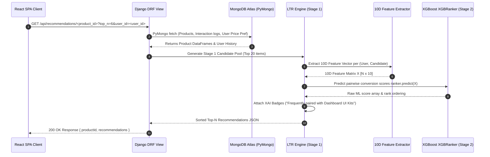

# NeuroUX Component Marketplace with Hybrid Recommendation Engine

This repository hosts a multi-service MERN + Django project for buying and selling UI/UX components.

## Project Structure

- `client/`: React + Vite + Tailwind CSS (Customer & admin frontend UI).
- `server/`: Node.js + Express + Mongoose (Auth, catalog CRUD, carts, orders, transactions, and admin APIs).
- `recommender/`: Django + DRF + Pandas + scikit-learn + PyMongo (Content-based, collaborative filtering, and hybrid recommendation engine).

## Quick Start (Development)

Detailed instructions for running each service are in their respective directories.

1. **Database:** Ensure MongoDB is running locally on `mongodb://localhost:27017/NeuroUX` or configure the connection string in `.env`.
2. **Seed Data:** Run `npm run seed:db` to seed the database with **47 pre-built UI/UX component products** and default admin/customer accounts.
3. **Server:** Navigate to `server/`, install dependencies (`npm install`), and run `npm run dev`.
4. **Client:** Navigate to `client/`, install dependencies (`npm install`), and run `npm run dev`.
5. **Recommender:** Navigate to `recommender/`, set up `.venv`, install `requirements.txt`, and run `python manage.py runserver`.

---

## 🔒 Security Configuration & Environment Setup

Before running in development or production, copy `.env.example` files to `.env` in `server/`, `client/`, and `recommender/`.

### Generating a Secure JWT Secret
Never use plain text or hardcoded values for `JWT_SECRET`. Generate a cryptographically secure 256-bit secret key using either OpenSSL or Node.js:

```bash
# Using OpenSSL (recommended)
openssl rand -base64 32

# Or using Node.js crypto module
node -e "console.log(require('crypto').randomBytes(32).toString('base64'))"
```

Copy the generated 64-character output into `JWT_SECRET` in `server/.env`.

---

## 🔁 Recommendation Call Sequence & Lifecycle



---

## 📡 API Reference Manual

For a complete specification of all Express REST API endpoints and Django Recommender API endpoints, refer to [API.md](./API.md).

---

## 🛣️ Known Limitations & Roadmap

| Feature | Current Demo / Implementation | Production Roadmap |
| :--- | :--- | :--- |
| **Payment Gateway** | Simulated payment verification flow (`paymentController.js`) | Webhook-based signature verification with live Razorpay / Stripe gateway |
| **Recommendation Cache** | Process-level in-memory TTL cache (`SimpleTTLCache`) | Centralized distributed Redis instance (`redis-py` / `django-redis`) |
| **Model Retraining** | On-demand script execution (`train_ltr.py`) with versioning & sanity promotion | Scheduled cron job / Celery Beat pipeline |
| **Email Service** | Ethereal console output in development | Production SMTP via SendGrid, Mailgun, or AWS SES |
| **A/B Testing** | 50/50 static traffic split | Statistical significance testing & automated champion model promotion |


