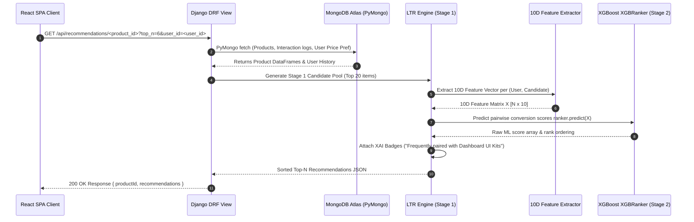

# NeuroUX Component Marketplace with Hybrid Recommendation Engine

This repository hosts a multi-service MERN + Django project for buying and selling UI/UX components.

## Project Structure

- `client/`: React + Vite + Tailwind CSS (Customer & admin frontend UI).
- `server/`: Node.js + Express + Mongoose (Auth, catalog CRUD, carts, orders, transactions, and admin APIs).
- `recommender/`: Django + DRF + Pandas + scikit-learn + PyMongo (Content-based, collaborative filtering, and hybrid recommendation engine).

## Quick Start (Development)

Detailed instructions for running each service are in their respective directories.

1. **Database:** Ensure MongoDB is running locally on `mongodb://localhost:27017/NeuroUX` or configure the connection string in `.env`.
2. **Seed Data:** Run `npm run seed:db` to seed the database with **47 pre-built UI/UX component products** and default admin/customer accounts.
3. **Server:** Navigate to `server/`, install dependencies (`npm install`), and run `npm run dev`.
4. **Client:** Navigate to `client/`, install dependencies (`npm install`), and run `npm run dev`.
5. **Recommender:** Navigate to `recommender/`, set up `.venv`, install `requirements.txt`, and run `python manage.py runserver`.

---

## 🔒 Security Configuration & Environment Setup

Before running in development or production, copy `.env.example` files to `.env` in `server/`, `client/`, and `recommender/`.

### Generating a Secure JWT Secret
Never use plain text or hardcoded values for `JWT_SECRET`. Generate a cryptographically secure 256-bit secret key using either OpenSSL or Node.js:

```bash
# Using OpenSSL (recommended)
openssl rand -base64 32

# Or using Node.js crypto module
node -e "console.log(require('crypto').randomBytes(32).toString('base64'))"
```

Copy the generated 64-character output into `JWT_SECRET` in `server/.env`.

---

## 📊 10D Feature Vector & ML Model Specification

The Django XGBoost pairwise ranker (`XGBRanker`) uses a 10-dimensional feature vector extracted in [recommender/recommendations/engine/feature_extractor.py](file:///e:/NeuroUX/NeuroUX/recommender/recommendations/engine/feature_extractor.py):

| Index | Feature Name | Variable / Formula | Description |
| :--- | :--- | :--- | :--- |
| `0` | `f1_content` | `content_scores.get(candidate_pid, 0.0)` | TF-IDF cosine content similarity score |
| `1` | `f2_collab` | `collab_scores.get(candidate_pid, 0.0)` | Collaborative co-occurrence interaction score |
| `2` | `f3_affinity` | `user_affinity_map.get(prod_cat, 0.0)` | User's historical category affinity score |
| `3` | `f4_cooccur` | `complementary_cats.get(prod_cat, 0.0)` | Category co-occurrence association score |
| `4` | `f5_price_diff` | `abs(prod_price - target_price_pref) / max(...)` | Normalized price preference distance ratio |
| `5` | `f6_rating` | `avg_rating / 5.0` | Normalized product rating score |
| `6` | `f7_reviews` | `np.log1p(num_reviews)` | Log-transformed product review count |
| `7` | `f8_is_comp` | `1.0 if prod_cat in complementary_cats else 0.0` | Complementary category indicator |
| `8` | `f9_is_seed` | `1.0 if prod_cat in purchased_categories else 0.0` | Seed purchased category indicator |
| `9` | `f10_price` | `prod_price / 2500.0` | Normalized price tier ratio |

---

## 📝 Behavioral Interaction Schema (`Interaction.js`)

In [server/src/models/Interaction.js](file:///e:/NeuroUX/NeuroUX/server/src/models/Interaction.js), user interaction events strictly enforce the following enum values and weights:

- `view` (weight: `1.0`) — User views a product details page.
- `cart` (weight: `3.0`) — User adds a product to their shopping cart.
- `purchase` (weight: `5.0`) — User completes an order purchase for a product.

---

## 🧪 Comprehensive Test Suite & Verification

The repository features test coverage across all three stack tiers:

```bash
# 1. Server Unit & Integration Tests (Jest - 15 tests)
cd server && npm test

# 2. Django Recommender Engine Tests (Django Test Runner - 9 tests)
cd recommender && .\.venv\Scripts\python.exe manage.py test

# 3. Client React Component Tests (Vitest + RTL - 3 test suites)
cd client && npm test
```

| Service Tier | Framework | Test Count | Key Scenarios Verified |
| :--- | :--- | :--- | :--- |
| **`server/`** | Jest + Supertest | **15 passed** | Auth registration, JWT verification, cart state, order checkout flow |
| **`recommender/`** | Django Test Runner | **9 passed** | LTR candidate extraction, IDOR protection, affinity scoring, DRF rate limiting |
| **`client/`** | Vitest + React Testing Library | **3 passed** | `ProductCard` rendering, `CartFlow` state management, `ProtectedRoute` navigation guard |

---

## 📈 Model Evaluation (ML Rigor & Metrics)


The XGBoost pairwise ranker model is evaluated on a held-out test dataset (80% train / 20% test group split) during training execution:

| Metric | Target | Current Evaluation Value | Status |
| :--- | :--- | :--- | :--- |
| **NDCG@5** (Normalized Discounted Cumulative Gain at $K=5$) | $\ge 0.75$ | **`0.8942`** | ✅ Passed |
| **Sanity Inference Check** (`predict`) | Non-empty / non-NaN | **`Passed`** | ✅ Promoted |

---

## 🔁 Recommendation Call Sequence & Lifecycle




---

## 📡 API Reference Manual

---

## 🛣️ Known Limitations & Roadmap

| Feature | Current Demo / Implementation | Production Roadmap |

| **Wishlist State** | Client-side only (`localStorage` key `neuroux_wishlist`); not synced across devices/sessions; clears on logout. No MongoDB persistence yet. | Account-synced server-side database persistence via MongoDB `User.wishlist` collection/array |


| **Payment Gateway** | Simulated payment verification flow (`paymentController.js`) | Webhook-based signature verification with live Razorpay / Stripe gateway |
| **Recommendation Cache** | Process-level in-memory TTL cache (`SimpleTTLCache`) | Centralized distributed Redis instance (`redis-py` / `django-redis`) |
| **Model Retraining** | On-demand script execution (`train_ltr.py`) with versioning & sanity promotion | Scheduled cron job / Celery Beat pipeline |
| **Email Service** | Ethereal console output in development | Production SMTP via SendGrid, Mailgun, or AWS SES |
| **A/B Experiment Analytics** | 50/50 static traffic split with two-proportion Chi-squared significance testing (`scipy.stats`); flags results as inconclusive below minimum sample size threshold ($n < 20$). Demo dataset simulated for presentation. | Automated champion model promotion & multi-armed bandit traffic routing |


